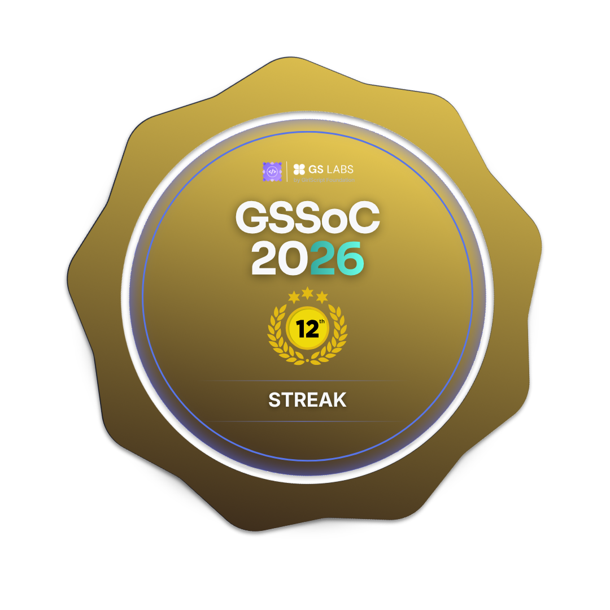

<h1 align="center">SUBHASH B</h1>
<h3 align="center"> AI & ML Student | Web Developer</h3>

  
  
  

## 🏆 Achievements

 

  
  
  
  
  
  
  
  

  

## 👨‍💻 About Me

- I’m currently learning **DSA + Web Development**
- I’m looking to collaborate on **AI/ML Projects**
- Interested in AI, web development, and building real-world projects
- Continuously learning and improving through hands-on practice and coding challenges.

---

## 🧠 I code in

---
## 📊 GitHub Stats

  
  

  

